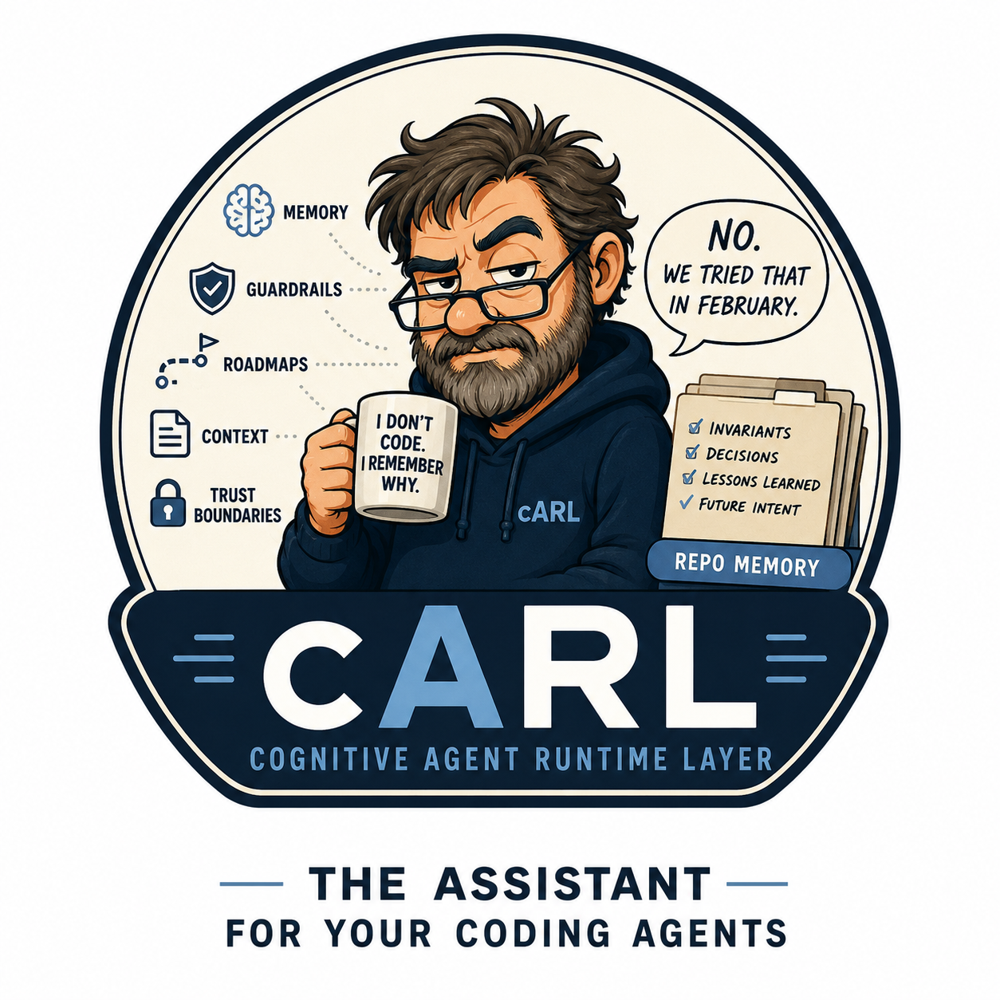

<!-- version: 1.7.0 -->



# cARL — Cognitive Agent Runtime Layer

[](https://github.com/goldjg/cARL/releases/latest)
[](go.mod)
[](https://github.com/goldjg/cARL/actions/workflows/release.yml)
[](https://github.com/goldjg/cARL/actions/workflows/goreleaser-check.yml)
[](LICENSE)

[](CLI.md#carl-harness-list)
[](CLI.md#carl-harness-list)
[](CLI.md#carl-harness-list)
[](CLI.md#carl-harness-list)
[](CLI.md#carl-harness-list)

> **"cARL remembers why you made that decision three months ago, because neither you nor your coding agent will."**

---

## What is cARL?

cARL (Cognitive Agent Runtime Layer) is a version-controlled governance and instruction layer that sits inside your repository and shapes how AI coding agents behave — every session, every task, without re-prompting.

It is not a framework. It is not a library. It is a set of committed files that give your agent persistent memory, engineering discipline, and bounded execution contracts.

---

## Start here

Install the CLI from
[GitHub Releases](https://github.com/goldjg/cARL/releases),
[Homebrew](#homebrew-macos--linux), or [WinGet](#winget-windows), then run:

```sh
cd /path/to/your-repository
carl init
carl doctor
carl status
```

If cARL files already exist but `.github/carl/runtime.json` does not, use
`carl init --adopt`; ordinary `init` stops rather than overwrite them. See the
[detailed quick start](#quick-start-cli), the
[v1 compatibility promise](COMPATIBILITY.md), and the
[`v1.0.0-rc.1` readiness evidence](RELEASE_READINESS.md).

The three production-validated harnesses are GitHub Copilot, Claude Code, and
Codex. Cursor and Antigravity adapters can be generated and synchronised, but
remain theoretical until native-harness validation exists.

---

## The Problem cARL Solves

AI coding agents are powerful but amnesiac. Every session starts from scratch. Each new task re-discovers the same architectural decisions, security constraints, and engineering conventions — or ignores them entirely.

The result is inconsistent behaviour, security regressions, dependency sprawl, and agents that confidently do the wrong thing because nobody told them otherwise — again.

cARL solves this by providing:

| Problem | cARL solution |
|---|---|
| Agent forgets architecture decisions | Durable truth cache in `.github/carl/memory.md` |
| Agent ignores engineering standards | Modular instruction packs loaded every session |
| Agent drifts out of scope mid-task | PR contracts constrain execution to approved scope |
| Agent uses wrong tools recklessly | Tiered tool-permission governance |
| Agent over-reasons or under-reasons | Cognition governance: minimum sufficient depth |
| Session is lost, work is lost | Prompt-as-code plans in `.github/carl/plans/` |
| Team cannot tell why policy is active | Local policy provenance via `carl explain` and `carl trace` |

---

## How cARL Differs from ADRs

Architecture Decision Records (ADRs) are documents written for humans. They record decisions after the fact and are read by developers during onboarding or code review.

cARL is agent-readable, partly structured governance written for agents. It is loaded before every task, not consulted after the fact. Where an ADR records why a decision was made, cARL enforces what the agent should and should not do as a result.

| | ADR | cARL |
|---|---|---|
| **Audience** | Human developers | AI coding agents |
| **When used** | After decision, during review | Before every task |
| **Format** | Prose narrative | Structured instruction packs + YAML |
| **Enforcement** | None (human discipline) | Loaded into agent context every session |
| **Scope** | Single decision | Entire operating model |

cARL complements ADRs. Use ADRs for human record-keeping. Use cARL to make those decisions machine-enforceable.

---

## How cARL Differs from Prompt Engineering

Prompt engineering is per-task. You write a prompt, get a result, and the instruction vanishes when the session ends.

cARL is persistent. Instructions live in committed files. They are version-controlled, diffable, auditable, and always in scope. They survive model upgrades, session resets, and team member turnover.

| | Prompt Engineering | cARL |
|---|---|---|
| **Persistence** | Per-session | Version-controlled |
| **Discoverability** | Lost when session ends | Always in the repository |
| **Consistency** | Re-typed or forgotten | Loaded automatically every session |
| **Auditability** | None | Full git history |
| **Team sharing** | Copy-paste | Committed and shared via version control |

---

## How cARL Differs from Agent Frameworks

Agent frameworks (LangChain, AutoGen, CrewAI, etc.) are code. They orchestrate agents programmatically, define tool schemas, and wire up models in code.

cARL is behavioural governance. It does not execute code. It shapes how an
agent reasons, plans, and acts inside an existing coding-agent harness.
GitHub Copilot, Claude Code, and Codex are production-supported. No new
runtime dependencies. No code to run. Cursor and Antigravity adapters are
implemented and synchronised, but remain theoretical until they are tested
end-to-end in their native harnesses.

| | Agent Frameworks | cARL |
|---|---|---|
| **Nature** | Code libraries | Committed governance files |
| **Deployment** | Runtime dependency | Repository files |
| **Target** | New agent applications | Existing coding agents (Copilot, Claude Code, Codex, Cursor, Antigravity) |
| **Concern** | Orchestration and tooling | Behavioural governance and discipline |
| **Language coupling** | Yes | Language-agnostic |

---

## Repository Structure

```
.github/
├── copilot-instructions.md          # Root operating model — loaded by Copilot automatically
├── carl/
│   ├── memory.md                    # Durable architectural truth cache
│   ├── current-pr-contract.md          # Active PR contract (populate before each PR)
│   ├── current-pr-contract.template.md # Blank template — copy to current-pr-contract.md
│   ├── packs.json                      # User-owned repository pack selection (when configured)
│   ├── profiles.example.json           # Inactive, cloneable complete-pack profile baseline
│   ├── profiles.json                   # User-owned named profiles and active role/task context (when configured)
│   ├── registries.json                 # Explicit pack registry locations (when configured)
│   ├── installed-packs.json            # Verified registry-pack provenance (when installed)
│   ├── invariants.yml               # Machine-readable governance invariants
│   ├── trust-boundaries.md          # Trust boundary definitions and crossing rules
│   ├── tool-policy.yml              # Tool permission tier policy (Tier 0/1/2)
│   ├── plans/
│   │   ├── README.md                # Prompt-as-code guidance for substantial tasks
│   │   └── plan-template.md         # Reusable cARL planning contract template
│   ├── repo-map.json                # Generated inventory and cognitive repository graph
│   └── repo-map.example.json        # Example graph schema for fast orientation
└── instructions/
    ├── core/
    │   ├── baseline.instructions.md
    │   ├── security.instructions.md
    │   ├── dependency.instructions.md
    │   ├── identity.instructions.md
    │   ├── carl.instructions.md              # cARLv2 cognition governance phase model
    │   ├── cognition-governance.instructions.md
    │   ├── tool-permission-tiers.instructions.md
    │   ├── memory-cache.instructions.md
    │   └── pr-contract.instructions.md
    ├── languages/
    │   ├── go.instructions.md
    │   ├── python.instructions.md
    │   ├── typescript.instructions.md
    │   ├── javascript.instructions.md
    │   ├── terraform.instructions.md
    │   ├── powershell.instructions.md
    │   └── html.instructions.md
    ├── platform/
    │   ├── cicd.instructions.md
    │   ├── docker.instructions.md
    │   └── kubernetes.instructions.md
    └── cloud/
        ├── azure.instructions.md
        ├── entra.instructions.md
        ├── microsoft-graph.instructions.md
        ├── gcp.instructions.md
        └── netlify.instructions.md

README.md
VISION.md
ARCHITECTURE.md
ROADMAP.md
GLOSSARY.md
CLI.md
```

---

## How It Works

1. A harness adapter loads `.github/copilot-instructions.md`, the shared cARL
   adapter loader, at the start of an agent session.
2. The loader hydrates the root operating model: plan-first discipline,
   security constraints, and cognition governance.
3. Individual packs under `.github/instructions/` provide focused guidance
   per language, platform, or cloud provider.
4. `.github/carl/` contains durable governance artefacts: memory cache, PR
   contract, invariants, trust boundaries, and plans.
5. `carl map` generates a schema-versioned cognitive graph of components,
   artefacts, repository-local Go dependencies, direct change impact,
   trust-boundary classifications, policy attachment points, and evidence
   coverage. It does not guess owners, runtime data flows, or active policy.

`carl harness status` can prove only that an adapter entrypoint is present and
that its managed files match embedded canonical sources. That local evidence
does not prove that a native harness loaded or obeyed governance.

---

## Quick Start (CLI)

The `carl` CLI installs and manages the cARL runtime in any repository.
It is a single self-contained binary — no dependencies, no network required after download.

### 1. Install the CLI

#### Download a release archive (Linux / macOS)

Download the latest archive for your platform from the
[releases page](https://github.com/goldjg/cARL/releases/latest).
For the release candidate, use the prerelease page rather than
`releases/latest`:

```sh
# Linux (amd64)
curl -L https://github.com/goldjg/cARL/releases/download/v1.0.0-rc.1/carl_1.0.0-rc.1_linux_amd64.tar.gz \
  | tar xz && sudo mv carl /usr/local/bin/carl

# macOS (Apple Silicon)
curl -L https://github.com/goldjg/cARL/releases/download/v1.0.0-rc.1/carl_1.0.0-rc.1_darwin_arm64.tar.gz \
  | tar xz && sudo mv carl /usr/local/bin/carl

# macOS (Intel)
curl -L https://github.com/goldjg/cARL/releases/download/v1.0.0-rc.1/carl_1.0.0-rc.1_darwin_amd64.tar.gz \
  | tar xz && sudo mv carl /usr/local/bin/carl
```

Windows users: download `carl_1.0.0-rc.1_windows_amd64.zip` from the
[`v1.0.0-rc.1` prerelease](https://github.com/goldjg/cARL/releases/tag/v1.0.0-rc.1),
extract `carl.exe`, and add it to your `PATH`.

#### WinGet (Windows)

```sh
winget install goldjg.cARL
```

#### Native Linux packages (deb / rpm / apk)

`.deb`, `.rpm`, and `.apk` packages are also attached to each GitHub Release.
See [DISTRIBUTION.md](DISTRIBUTION.md) for install commands.

#### Homebrew (macOS / Linux)

macOS release artefacts are configured for Developer ID signing, hardened
runtime, and App Store Connect notarisation; see
[DISTRIBUTION.md](DISTRIBUTION.md).

```sh
brew tap goldjg/carl
brew trust goldjg/carl
brew install --cask carl

brew uninstall --cask carl
brew untrust goldjg/carl
brew untap goldjg/carl
```

#### Build from source (requires Go 1.24+)

```sh
go install github.com/goldjg/carl/cmd/carl@latest
```

### 2. Install the runtime into your repository

Navigate to the root of any repository and run:

```sh
cd /path/to/your-repo
carl init
```

This writes all governance artefacts into `.github/` and creates
`.github/carl/runtime.json` as the authoritative runtime manifest.

If the repository already contains cARL artefacts but has no runtime manifest,
adopt them without overwriting existing content:

```sh
carl init --adopt
```

Adoption installs only missing bundled artefacts and creates `runtime.json`
last. Follow it with `carl doctor`, and run `carl repair` only when you
explicitly want drifted repairable files restored to bundled canonical
content. Repository `memory.md` remains protected.

### 3. Verify the installation

```sh
carl version
```

Expected output:
```
cARL CLI:
  Version:          1.0.0-rc.1
Bundled Runtime:
  Version:          1.0.0-rc.1
  Source:           goldjg/cARL
  Tag:              v1.0.0-rc.1
  Commit:           5f24ebc7...
Repository Runtime:
  Version:          1.0.0-rc.1
  Source:           goldjg/cARL
  Tag:              v1.0.0-rc.1
  Commit:           5f24ebc7...
  Status:           Current
```

Version semantics:

- **CLI version** identifies the executable and command implementation.
- **Bundled runtime version** identifies the canonical governance payload embedded in the executable.
- **Repository runtime version** identifies the runtime currently installed in the repository (`.github/carl/runtime.json`).

To inspect bundled vs installed pack/shim component versions directly:

```sh
carl version --components
```

### 4. Restore drift

If any managed artefacts are modified and you want to restore them to their
canonical state:

```sh
carl repair
```

> `memory.md` and `runtime.json` are protected and are never overwritten by `repair`.

### 5. Diagnose issues

Run a health check with actionable guidance for any issues found:

```sh
carl doctor
```

Expected output when healthy:
```
INFO    runtime is healthy — all managed artefacts are present and canonical
```

See [CLI.md](CLI.md) for the full command reference.

### 6. Explore and compose packs

List every discoverable instruction pack (bundled in the binary, present in
the repository, selected in `.github/carl/packs.json`, or installed from an
explicit registry), inspect one pack's versioned metadata, select packs for
the repository, activate a named profile/role/task context, and compute the
effective pack set:

```sh
carl pack list
carl pack show core/security
carl pack select languages/go core/security
carl pack profile list
# After defining .github/carl/profiles.json:
carl pack profile activate developer
carl pack effective
carl explain core/security
carl trace
```

Repositories may optionally define HTTPS or repository-local registry indexes
in `.github/carl/registries.json`. Registry access happens only when a
registry search, install, or update command is invoked:

```sh
carl pack registry list
carl pack registry search rust
carl pack install languages/rust
carl pack update languages/rust
```

Registry artifacts must be relative to their configured index and carry a
SHA-256 digest. cARL verifies the digest and pack metadata before writing,
records deterministic provenance in `.github/carl/installed-packs.json`, and
refuses to overwrite unowned repository-local packs or locally drifted
registry-managed packs. SHA-256 verifies integrity against the configured
index; it does not authenticate publisher identity. Installation does not
select or activate a pack and never writes `.github/carl/runtime.json`.

All `carl pack` subcommands support `--json` for machine-readable output;
`list`, `show`,
`profile list`, and `effective` work outside an initialised repository
(bundled packs only).
Ordering is deterministic (sorted by pack ID; effective output in precedence
order), never filesystem order. Composition is conservative: non-overridden
effective packs add constraints, required dependencies are expanded with
explicit reasons, and
overrides require explicit metadata plus an `overridable` target. Overridden
entries remain visible for provenance but their instruction definitions are
not applied. Named
profiles are defined in the committed `.github/carl/profiles.json` artefact;
organisation/repository defaults and role/task overlays compose additively.
When that artefact is absent, selected packs remain active for compatibility.
Fresh installations also include `.github/carl/profiles.example.json`, an
inactive `default` profile that explicitly names the complete shipped pack
set. Copy it to `.github/carl/profiles.json` to adopt and customise the
baseline. The example does not select or activate anything merely by being
installed, and every copied profile reference must already be selected.

Pack state is deliberately explicit:

| State | Meaning |
|---|---|
| Present | A bundled, repository-local, or registry-managed definition is discoverable |
| Selected | Repository selection authority includes the pack |
| Active | A profile/default/role/task seed includes it, or profile-absent compatibility treats selection as active |
| Effective | The active seed or required dependency survived validation and composition |
| Overridden | The pack remains visible for provenance but its definition is not applied |

For the opt-in enterprise examples, follow the fail-safe order: copy the
default-only bootstrap, select the 11 enterprise packs, copy the full
catalogue, and then activate a profile explicitly. See
[the enterprise adoption guide](.github/carl/enterprise-profiles.md).

Agents do not need the `carl` binary to hydrate governance. The shared loader
in `.github/copilot-instructions.md` derives selection from `packs.json` or
the legacy `runtime.json` fallback, derives active seeds from `profiles.json`
when present, resolves dependencies/precedence/overrides, and applies only
effective non-overridden definitions. Repository presence is not activation,
filesystem order is not policy order, and invalid state stops hydration rather
than loading every pack.

`carl explain <pack-id>` reports whether one discoverable pack is in the
effective policy, where its canonical definition came from, how selection or
profile activation included it, which pack required it, and its precedence
and resolved override state. `carl trace` reports the complete effective set
and its activation, dependency, ordering, override, and conflict decisions.
Both commands are deterministic, local-only, read-only, and support `--json`.
They explain pack-level policy provenance; they do not interpret individual
natural-language rules or expose prompts, hidden model reasoning, or
chain-of-thought.

### 7. Migrate from AADLC (existing repositories)

If your repository already contains governance knowledge under legacy AADLC
artefacts (`.aadlc/`, `.github/aadlc/`, `AADLC.md`, ...), migrate that durable
knowledge into canonical cARL artefacts so adoption does not lose accumulated
context:

```sh
carl convert aadlc --dry-run   # analyse and report; makes no changes
carl convert aadlc --apply     # perform the migration
```

`carl convert` discovers AADLC artefacts, classifies their content into
invariants, durable memory, and governance rules, and migrates them into
`.github/carl/invariants.yml` and `.github/carl/memory.md`. It never deletes or
modifies AADLC artefacts, never overwrites existing cARL knowledge (duplicates
are skipped and conflicts are reported for human review), and is idempotent.

The typical end-to-end adoption workflow is:

```sh
carl init
carl map
carl reconcile
carl convert aadlc
carl harness sync
```

The generated repo map keeps its original inventory sections for compatibility
and adds stable graph nodes and evidence-backed edges. Use `carl trace`—not the
graph—to determine which instruction packs are active.

---

## Upgrade from v0.4.3

First inspect the version layers with the new binary:

```sh
carl version
carl status
carl doctor
```

Back up and move `.github/carl/runtime.json` outside the managed runtime path,
then run:

```sh
carl init --adopt
carl doctor
carl repair
carl status
carl harness status
carl pack effective
carl map
carl reconcile
```

`init --adopt` preserves existing files, installs missing bundled artefacts,
and creates the new manifest last. `repair` is a separate explicit choice that
updates only declared repairable runtime-owned assets; memory and user-owned
policy/provenance remain protected. Keep the old manifest backup until the
upgrade is reviewed.

---

## Troubleshooting

- **Apple Gatekeeper:** verify the archive against `checksums.txt`, then inspect
  the installed binary with
  `spctl --assess --type execute --verbose /path/to/carl`. Re-download from the
  official release if validation fails; do not bypass Gatekeeper for an
  unverified binary.
- **Runtime drift:** run `carl doctor`, review every finding, and use
  `carl repair` only for runtime-owned assets you intend to restore.
- **Adoption deadlock:** if ordinary `init` reports existing artefacts and no
  runtime manifest exists, use `carl init --adopt`; do not delete
  repository-specific memory or user policy to force installation.
- **Malformed profile selection:** run `carl pack profile list --json` and
  `carl pack effective --json`, then fix the reported
  `.github/carl/profiles.json` reference or restore a reviewed valid copy.
- **Composition conflicts:** use `carl trace --json`; resolve the reported
  dependency or explicit override metadata instead of changing load order or
  disabling validation.

See [CLI.md](CLI.md) for command details and
[DISTRIBUTION.md](DISTRIBUTION.md) for package and signing diagnostics.

---

## Usage

### Using this repository directly

Fork or copy into your GitHub account or organisation. Run
`carl harness sync` to generate all five adapters from the canonical embedded
artefacts. Copilot, Claude Code, and Codex are production-supported; Cursor and
Antigravity are implemented but await native-harness validation.

### Copying packs into another repository

Copy any individual pack from `.github/instructions/` into the same path in your target repository. For full cARLv2 usage, also copy `.github/carl/` and populate the artefacts for your project.

### Versioning

Each file carries a `<!-- version: X.Y.Z -->` comment. Increment using Semantic Versioning:
- **MAJOR** — breaking change to conventions
- **MINOR** — new guidance added compatibly
- **PATCH** — clarifications or corrections

---

## Pack Summary

### Core Packs
| Pack | Purpose |
|---|---|
| `baseline` | Engineering operating model, plan-first, test discipline |
| `security` | No secrets, input validation, SSRF prevention |
| `dependency` | CVE management, native-first, justification required |
| `identity` | Token validation, trust boundary discipline |
| `carl` | cARLv2 phase model and cognition governance |
| `cognition-governance` | Minimum sufficient reasoning depth |
| `tool-permission-tiers` | Tier 0/1/2 tool classification and escalation |
| `memory-cache` | Durable truth cache governance |
| `pr-contract` | Scoped implementation contract lifecycle |

### Language Packs
Go · Python · TypeScript · JavaScript · Terraform · PowerShell · HTML

### Platform Packs
CI/CD · Docker · Kubernetes

### Cloud Packs
Azure · Microsoft Entra ID · Microsoft Graph · Google Cloud Platform · Netlify

---

## Contributing

1. Open an issue describing the gap or new pack.
2. Follow naming: `<name>.instructions.md` in the appropriate subdirectory.
3. Keep each pack focused on a single concern.
4. Add `<!-- version: 1.0.0 -->` at the top of any new file.
5. Update this README and [CLI.md](CLI.md) if the change affects the CLI.

---

## Roadmap

See [ROADMAP.md](ROADMAP.md) for planned evolution.

The stable `1.x` contract is in [COMPATIBILITY.md](COMPATIBILITY.md).
Release-candidate evidence and limitations are in
[RELEASE_READINESS.md](RELEASE_READINESS.md), and the prepared prerelease notes
are in [RELEASE_NOTES_v1.0.0-rc.1.md](RELEASE_NOTES_v1.0.0-rc.1.md).

---

## License

See repository root for licence information.
